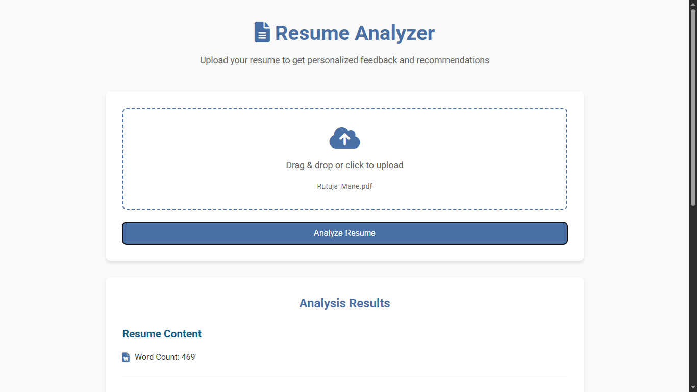

# 📄 Resume Analyzer – AI-Powered Resume Review  

An AI-based web application that analyzes resumes, extracts key information, and provides actionable feedback using **Natural Language Processing (NLP)**.  

---

## 🚀 Features  
- ⚡ **Automatic Resume Parsing** – Extracts text from PDF and DOCX resumes.  
- 🧠 **NLP-Powered Insights** – Identifies missing sections, detects keywords, and extracts skills.  
- 📊 **Content Scoring** – Highlights resume length issues (too short / too long).  
- 🛠️ **Actionable Recommendations** – Provides suggestions to improve resume quality.  
- 🌐 **Modern Web App** – Built using **Flask** with a clean, responsive interface.  

---

## ⚙️ Technologies Used  
- **Backend**: Python (Flask)  
- **NLP & Libraries**: NLTK, spaCy, scikit-learn  
- **Text Extraction**: PyPDF2, docx2txt  
- **Frontend**: HTML, CSS, JavaScript (Flask templates)  
- **Deployment**: Local (Flask server) or Cloud (Render/Vercel/Heroku)  

---

## 🛠️ How It Works  
1. **Upload Resume** → User uploads PDF or DOCX file.  
2. **Text Extraction** → Extracts raw text using PyPDF2/docx2txt.  
3. **Preprocessing & NLP** → Cleans and tokenizes text using spaCy and NLTK.  
4. **Analysis** → Detects missing sections, skill keywords, and calculates word count.  
5. **Feedback Generation** → Provides improvement recommendations in real-time JSON or HTML response.  

---

## 🐍 Prerequisites  
- Python 3.8+  
- pip (Python package manager)  

---

## 📥 Installation  

#### 1️⃣ Clone the repository  
```bash
git clone https://github.com/yourusername/resume-analyzer.git
cd resume-analyzer

## 🖼️ Project UI Preview


